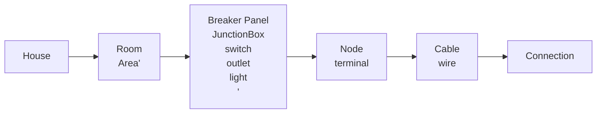

# HomeGrid Navigation and Structure Overhaul

## Problem to be Solved

The User interface become increasingly more difficult to use as the grid gets more and more complex and cluttered. This is true exponentially when using an iPad.

## Proposed new structure

### Hierarchy of Elements as a Navigation Structure

### New Definitions

- FloorPlan: A collection of Rooms and Areas that forms the basis for navigation.

- Room: A rectangular section of a FloorPlan that houses JunctionBoxes, BreakerPanels, Lights, Switches, and Outlets. Has a visual component to help the user map out the real world environment, including the placement of icons representing common household items. These are only selectable while creating or editing FloorPlans.

- Area: A rectangular section that overlaps Rooms and is used only for navigation. Does not contain any other elements.

- Navigator: A text-based outline of the FloorPlan that is used to navigate to specific parts of the canvas. Lives on the side of the canvas. The FloorPlan is the top-most element in the navigator and shows the entire floorplan when active. Nested inside the FloorPlan are Rooms. Inside Rooms are JunctionBoxes, Outlets, Switches, and Lights. Under those are wires. Connections between wires should be under both of the wires.

### Workflow

- When creating a new file, the user should be asked if they would like to create a new floor plan, use a saved floor plan, or use in Sandbox mode. 

- When making a floor plan the user creates rooms by clicking and dragging to the appropriate size. Rooms should lock onto other rooms so they share walls. Doors can be added to walls   

- Once a FloorPlan is loaded (in Sandbox mode the entire canvas is considered one room labeled "Sandbox") the user will have access to the Navigator.

- All elements other than the FloorPlan should be collapsed by default. When the user selects an element from the Navigator it becomes active the zoom level and position of the canvas should change to zoom into it and the elements directly under it should become visible in the navigator.

