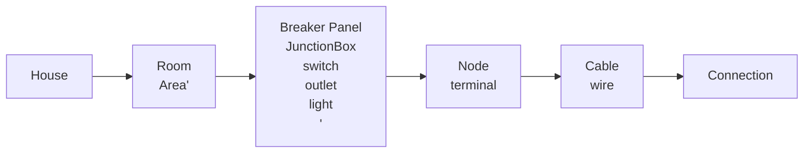

# HomeGrid Navigation and Structure Overhaul

## Problem to be Solved

The User interface become increasingly more difficult to use as the grid gets more and more complex and cluttered. This is true exponentially when using an iPad.

## Proposed new structure

### Hierarchy of Elements as a Navigation Structure

### Workflow

- When creating a new file, the user should be asked if they would like to create a new floorplan, use a saved floor plan,
